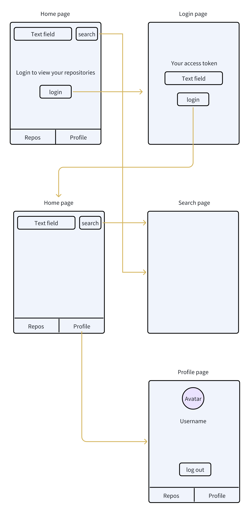
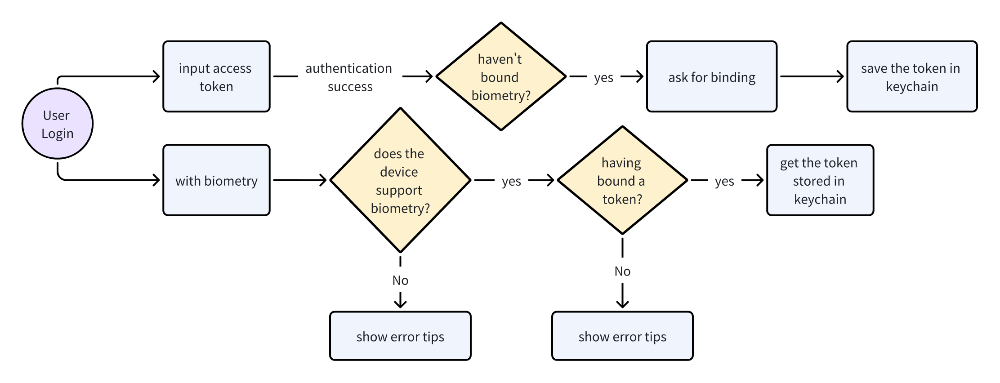

# MyGitHubApp

An iOS App providing the abilities to view your personal repositories as well as search the repositories online on GitHub.

## UX Design

## Features

* Main Pages:
  * The `Repos` tab lists your personal repositories.
  * The `Profile` tab shows your personal info.
  * The search bar at the top of the `Repos` tab can be used to search online repositories by typing keywords. The search results will be shown in a new page.

* Login:

  * Support login with access token or biometry.

    * **Don't know how to get your GitHub access token? **You can generate it by going to GitHub's 'Settings' -> 'Developer settings' -> 'Personal access tokens.'

  * You can log out by tap the "logout" button in the  `Profile` tab.

  * The flow chart:

    

## Showcase

See the video `showcase.mp4` under the `Resources` folder